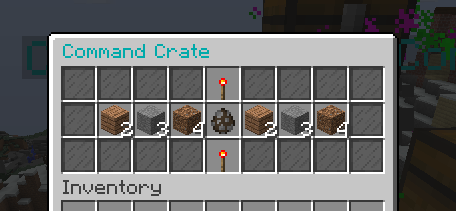
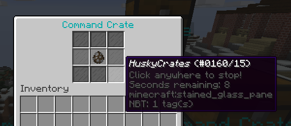

.. HuskyCrates - Last updated v1.7.2

Plugin Configuration
===============================
.. image:: http://i.imgur.com/ZRN1RVN.png

************
Starting Out
************

Any time you get confused during this process save yourself the stress and join `our support discord`_ for realtime help on writting your config file.

Use the sidebar as your guide on where fields are in terms of brace or bracket ladders.

We suggest using an app such as Sublime Text which has a HOCON module that can aid you in properly formatting your config files.

**Very important:** Please make sure you save your config in UTF-8 ecoding the *first* time you save! It will prevent a lot of potential problems for your config.
Please note that HOCON does sort everything within ladders alphabetically.

Your first line of every config is always going to be ``crates {``. This is necessasry to indicate that this is crates information
The next line is where your first crate is initiated this is your ``crate_id`` which you will use to call your crates in commands. Give it an easy to type name and type on the next line your ``<crate_id> {``.
You can have as many crates as you want but lets make your first crate.

***********
Crate Types
***********

``type="<options_below>"``

*Spinner View* ``spinner`` - Traditional HuskyCrates view, similar to CS:GO case. Items scroll randomly until an item is picked, `spinner view is customizeable.`_

*Roulette View* ``roulette`` - You have 10 seconds to make a selection, weight still affects how often items appear.

*Instant View* ``instant`` - No GUI is shown and items are recieved instantly with only a rewarding message appearing.

*Simple View* ``simple`` - Basically an instant view but with a short GUI display similar to roulette view.

**********
Conclusion
**********

If you made it here you successfully built a HuskyCrates config! Now that you have your config built check out the commands page in the sidebar if you haven't already. Go test your config, if you run into any problems make sure you check your syntax to make sure you didn't leave a brace or bracket without a friend or forgot a comma between items. The server console can help you in finding these issues as well by indicating the line in the config and the issue it has with it.

.. _our support discord: http://discord.gg/FSETtcx
.. _Look here for how to use lang.: http://com.com/
.. _count: http://huskycrates.readthedocs.io/en/1.7.x/config_write.html#count
.. _click here to use a color picker: https://www.google.com/search?q=rgb+color+picker
.. _spinner view is customizeable.: http://com.com/
